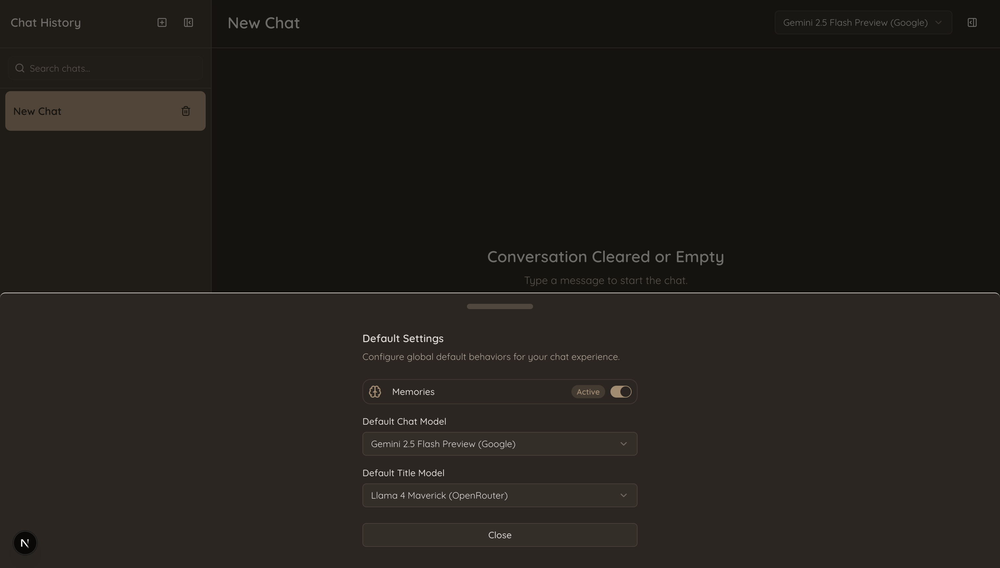
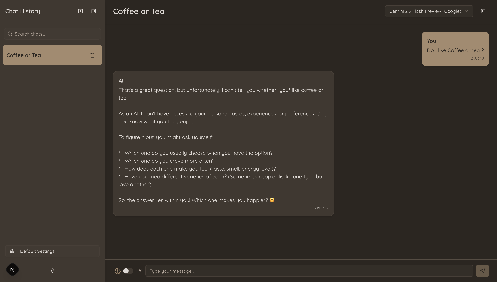
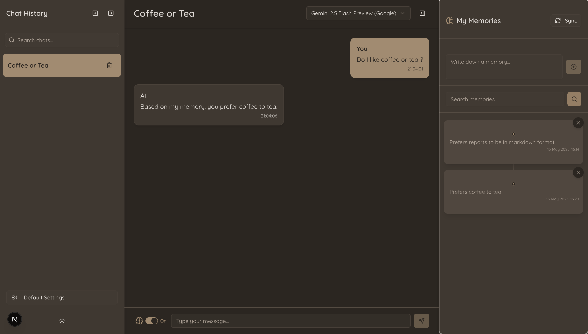

# Mem0Chat - AI Chat with Persistent Memory

This project is a Next.js application demonstrating an AI chat interface with a persistent memory layer powered by [Mem0.ai](https://mem0.ai/). It allows users to have conversations with various AI models, where the AI can recall information from previous interactions to provide more personalized and context-aware responses.

## Key Features

*   **AI Chat Interface:**  Chat UI built with Next.js, React, Radix UI, and Tailwind CSS.
*   **Chat History Sidebar:** Displays a list of past chat sessions, allowing users to easily navigate and revisit conversations. Stored locally using Dexie.js.
*   **Persistent Memory:** Utilizes [Mem0.ai](https://github.com/mem0ai/mem0) as "The Memory Layer for your AI Agents," enabling the chat application to remember user preferences or anything the user needs it to.
*   **Configurable AI Models:** Supports multiple AI models from Google (Gemini series) and OpenRouter (e.g., DeepSeek, Llama, Qwen). Users can set global default models and override them per chat session.
*   **Client-Side Data Persistence:** Leverages Dexie.js (IndexedDB wrapper) to store chat sessions, messages, and a local cache of memories, enabling faster load times and some offline access.
*   **Dynamic Title Generation:** Automatically generates concise titles for new chat conversations based on the initial message content.
*   **Real-time Streaming:** Streams AI responses for a smooth and interactive user experience using the Vercel AI SDK.
*   **Theming:** Supports light and dark modes.
*   **Animated UI:** Uses Framer Motion for subtle UI animations.

### Settings Overview
The application provides a "Default Settings" drawer where users can configure global preferences:
*   Toggle global memory activation.
*   Set the default AI model for chat.
*   Set the default AI model for title generation.



## Key Features in Action

### Memory Persistence

**1. Conversation without memory:** The AI responds without prior knowledge.



**2. Conversation with memory:** After a relevant memory is added (e.g., "Prefers coffee to tea"), the AI uses this information in its response. The "My Memories" panel shows the active memories.



## Technologies Used

*   **Framework:** Next.js 15
*   **Memory Layer:** [Mem0.ai](https://github.com/mem0ai/mem0) (`mem0ai` SDK)
*   **AI Model Providers:**
    *   Google (Gemini series)
    *   OpenRouter (DeepSeek, Llama, Qwen, etc.)
*   **UI Components:** Radix UI, Shadcn/ui 
*   **Styling:** Tailwind CSS
*   **Animations:** Framer Motion
*   **Client-Side Database:** Dexie.js (IndexedDB wrapper)
*   **Icons:** Lucide React


## Mem0.ai Integration

This project integrates [Mem0.ai](https://github.com/mem0ai/mem0) to provide a persistent memory layer for the AI. As described on their website, "Mem0 is a self-improving memory layer for LLM applications, enabling personalized AI experiences that save costs and delight users."

Key aspects of the Mem0.ai integration in this project:
*   **Memory Storage:** User interactions and explicitly added memories are stored via the Mem0.ai service.
*   **Contextual Retrieval:** Before sending a query to an AI model, the application searches Mem0.ai for relevant memories based on the current conversation context.
*   **Enhanced Prompts:** Retrieved memories are injected into the system prompt, providing the AI model with historical context and user preferences.
*   **Personalization:** This allows the AI to "remember" past interactions and tailor its responses accordingly.
*   **Client-Side Caching:** Memories fetched from Mem0.ai are cached locally using Dexie.js to improve performance.

The application uses the `mem0ai` JavaScript SDK to interact with the Mem0 Platform (Cloud version).

## Setup and Installation

1.  **Clone the repository:**
    ```bash
    git clone https://github.com/mzazakeith/Mem0Chat.git
    cd Mem0Chat
    ```

2.  **Install dependencies:**
    ```bash
    npm install
    # or
    # yarn install
    # or
    # pnpm install
    ```

3.  **Set up environment variables:**
    Create a `.env.local` file in the root of the project and add the following environment variables:

    ```env
    # Mem0.ai Credentials (Required for memory functionality)
    MEM0_API_KEY="your_mem0_api_key"
    MEM0_PROJECT_ID="your_mem0_project_id"

    # OpenRouter API Key (Required if using OpenRouter models)
    OPENROUTER_API_KEY="your_openrouter_api_key"

    # Google API Key 
    GOOGLE_GENERATIVE_AI_API_KEY="your_google_api_key"
    ```
    *   Obtain your `MEM0_API_KEY` and `MEM0_PROJECT_ID` from your [Mem0.ai dashboard](https://mem0.ai/).
    *   Obtain your `OPENROUTER_API_KEY` from your [OpenRouter dashboard](https://openrouter.ai/).

4.  **Run the development server:**
    ```bash
    npm run dev
    ```
    The application should now be running on [http://localhost:3000](http://localhost:3000).

## Acknowledgements

*   **[Mem0.ai](https://mem0.ai/):** For providing the intelligent memory layer.
*   **Vercel AI SDK:** For simplifying AI model integration and streaming.
